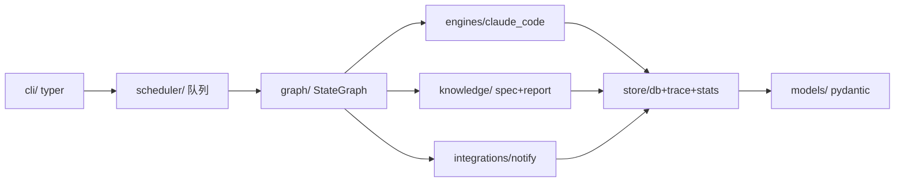

## 用户需求

在 `d:/workspace/lindaailabs/loopctl` 仓库（当前仅 LICENSE、README）从零搭建 `loopctl`——基于 LangGraph 的编码 agent 控制平面。本次将 **M0 骨架** 与 **M1 单任务本地闭环** 一并规划，按 M0→M1 顺序分步实现。git 提交身份以 local 配置写入 `lindadev77 / lindadev@aliyun.com`（loopctl 与后续 playbook 仓库均同）。开发文档 `loopctl-dev.md` 需落地为仓库内 `docs/SPEC.md`，并建立精简的 `CLAUDE.md` 引用它。

## 产品概述

loopctl 将 Claude Code 等编码引擎作为可插拔执行单元，实现「需求 → GitLab MR」的无人值守闭环。本阶段完成 M0（可运行骨架）与 M1（不含 GitLab 的单任务本地闭环：计划审批 gate、执行、测试、修复、报告蒸馏、断点恢复）。

## 核心功能

- M0：uv 工程与 src layout、ruff/pytest、GitHub Actions CI、`--help`/`projects`/`status` 命令（空数据可运行）、ADR-0001~0008 正式文件、`data/` gitignore、`docs/SPEC.md` + `CLAUDE.md` 落地。
- M1 配置与数据：project.toml + local override 合并加载、pydantic 数据模型、默认限额配置、SQLite checkpoint、trace/stats 落盘、`tests/fixtures/sample_py` 微型项目。
- M1 引擎与知识：claude_code backend（子进程、`claude -p` stream-json 解析、超时/心跳）、spec 上下文组装、报告蒸馏生成、ntfy 通知。
- M1 闭环：`run --fg` → clarifying → planning → plan gate(interrupt) → executing → testing → fixing ⇄ executing → reporting；`approve`/`reject`/`resume`/`watch`/`report`/`stats` 配套；Ctrl-C 后可 `resume` 续跑。

## 技术栈选择

- 语言/工具链：Python ≥ 3.11 · uv（包管理与虚拟环境）· ruff（lint+format）· pytest
- CLI：typer（命令层，薄）+ rich（表格/状态展示）；全局 `--json` 输出机器可读格式
- 编排：langgraph（StateGraph + SqliteSaver checkpointer，断点恢复）
- 数据：pydantic v2（模型）、标准库 `tomllib`（Python 3.11 内置，解析 project.toml）、`sqlite3`/langgraph SqliteSaver、JSONL 文件（trace/stats）
- 网络/通知：httpx（外部请求）+ ntfy（单 HTTP POST 通知）
- 严格禁止：celery/redis/fastapi/flask/django/langchain 高层封装/数据库服务（见 SPEC 第 7 节，锁定不可替换）

## 实现方案

**总体策略**：严格按 SPEC 第 4 节单向依赖 `cli → scheduler → graph → {engines, knowledge, integrations} → store → models` 分层落地。M0 先建立可运行空壳（不依赖具体引擎），M1 在骨架内填充状态机与引擎适配。

**关键决策与理由**：

1. **src layout + uv**：`src/loopctl` 配合 `uv`，避免导入歧义、利于 CI 复现；`pyproject.toml` 内联 ruff/pytest 配置，减少配置文件数量。
2. **配置加载用标准库 tomllib**：Python 3.11 已内置，零额外依赖；project.toml 与 `~/.loopctl/projects/<slug>.local.toml` 合并后映射到 pydantic `ProjectConfig`，机器路径永不进仓库（SPEC 6.3 + 第 0 节）。
3. **checkpoint 用 langgraph SqliteSaver**：状态持久化到 `data/loopctl.db`（gitignored），天然支持 interrupt/resume；trace/stats 用独立 JSONL 追加写入，职责分离。
4. **引擎抽象唯一凭证 `EngineBackend(Protocol)`**：claude_code 经子进程调 `claude -p --output-format stream-json`，负责进程生命周期、流解析、超时与心跳；所有 prompt 组装收敛到 `knowledge/`，`engines/` 不做业务判断（SPEC 4.1）。
5. **外部交互全部接口注入**：gitlab/notify/engine 均抽象，单元测试用录制 stream-json fixture 与 stub，不依赖网络（SPEC 第 9 节）。

**性能与可靠性**：state 图节点为异步协程；claude_code 子进程设默认 30min 超时 + 10min 心跳检测（kill→escalated）；测试失败触发 fixing 循环（上限 3 轮）；所有上限集中在 `models/config.py` 默认配置，可被项目级覆盖。M1 不实现 GitLab（creating_mr/awaiting_pr_review 属 M2）。

## 实现要点

- **零回归/最小爆炸半径**：M0 不引入任何运行时依赖的副作用，空数据命令必须幂等、可重复运行；CI 仅 lint+test，不部署。
- **日志**：复用 Python 标准 `logging`，仅记录状态转移与失败分类，避免把子进程 stdout 全量写日志（防止日志膨胀）。
- **向后兼容**：`--json` 全局开关在 M0 即接入，后续命令直接复用，避免后期返工。
- **git 身份**：在 loopctl 仓库执行 `git config --local user.name lindadev77` / `user.email lindadev@aliyun.com`；playbook 仓库创建时同样以 local 配置。

## 架构设计

分层单向依赖，M1 状态机如下（M2 的 creating_mr/awaiting_pr_review 预留但不实现）：



状态机（M1）：

```mermaid
flowchart LR
  Q[queued] --> CL[clarifying] --> PL[planning] --> GATE[awaiting_plan_approval interrupt]
  GATE -- approve --> EX[executing] --> TE[testing]
  TE -- fail --> FX[fixing] --> EX
  TE -- pass --> RP[reporting] --> DONE[done]
  GATE -- reject+feedback --> PL
  EX/TE/FX -. timeout/stuck/budget --> ESC[escalated]
```

## 目录结构

```
loopctl/
├── .github/workflows/ci.yml        # [NEW] GitHub Actions：ruff lint + pytest，Python 3.11
├── .gitignore                      # [NEW] 忽略 data/、__pycache__、.venv 等
├── pyproject.toml                  # [NEW] uv 工程：依赖、ruff、pytest、入口 loopctl
├── README.md                      # [MODIFY] 补充项目简介与快速开始
├── CLAUDE.md                      # [NEW] 精简纪律摘要，引用 docs/SPEC.md，声明第 0 节协议
├── docs/
│   ├── SPEC.md                    # [NEW] 落地 loopctl-dev.md 全文（权威规格）
│   └── decisions/
│       ├── adr-0001-naming.md     # [NEW] 命名 loopctl
│       ├── adr-0002-orchestrate.md# [NEW] 编排而非自建 agent
│       ├── adr-0003-repo-privacy.md # [NEW] 工具公开/playbook 私有
│       ├── adr-0004-local-data.md # [NEW] checkpoint/trace/stats 不入 git
│       ├── adr-0005-gates.md      # [NEW] 人工介入收敛两点 gate
│       ├── adr-0006-distillation.md # [NEW] 蒸馏为收尾节点
│       ├── adr-0007-sqlite-asyncio.md # [NEW] SQLite+asyncio 不上 Celery
│       └── adr-0008-concurrency.md # [NEW] 跨项目并行、项目内互斥
├── src/loopctl/
│   ├── __init__.py                # [NEW] 包初始化
│   ├── __main__.py                # [NEW] `python -m loopctl` 入口
│   ├── cli/
│   │   ├── __init__.py
│   │   ├── app.py                 # [NEW] typer 主应用，全局 --json
│   │   └── commands.py            # [NEW] status/projects(M0)；run/approve/reject/report/watch/stats/resume(M1)
│   ├── models/
│   │   ├── __init__.py
│   │   ├── task.py                # [NEW] Task、TaskState 枚举、Plan、Report 模型
│   │   ├── project.py             # [NEW] ProjectConfig（project.toml + local override 映射）
│   │   └── config.py             # [NEW] 默认限额（超时/budget/fix_loop）集中定义
│   ├── config/
│   │   └── loader.py              # [NEW] project.toml + local.toml 合并加载
│   ├── store/
│   │   ├── __init__.py
│   │   ├── db.py                  # [NEW] SqliteSaver 封装 + 任务状态读写
│   │   ├── trace.py               # [NEW] 逐行 JSONL trace 写入
│   │   └── stats.py               # [NEW] stats.jsonl 追加与聚合
│   ├── engines/
│   │   ├── __init__.py
│   │   ├── base.py                # [NEW] EngineBackend(Protocol)、EngineContext、EngineResult
│   │   └── claude_code.py         # [NEW] 子进程调用 claude -p、stream-json 解析、超时/心跳
│   ├── knowledge/
│   │   ├── __init__.py
│   │   ├── spec.py                # [NEW] 加载 spec_refs 显式引用
│   │   ├── context.py             # [NEW] 组装注入 prompt 的上下文（需求+计划+spec）
│   │   └── report.py              # [NEW] 按 6.4 模板蒸馏生成 Report.md
│   ├── graph/
│   │   ├── __init__.py
│   │   ├── state.py               # [NEW] GraphState（TypedDict/pydantic）
│   │   └── workflow.py            # [NEW] StateGraph：节点+gate interrupt+resume
│   ├── scheduler/
│   │   └── __init__.py            # [NEW] M1 最小占位（M3 充实队列/互斥）
│   └── integrations/
│       ├── __init__.py
│       ├── gitlab.py              # [NEW] M2 桩（M1 仅定义接口）
│       └── notify.py             # [NEW] ntfy 单 HTTP POST 通知（plan gate + escalated）
└── tests/
    ├── conftest.py                # [NEW] 临时 data 目录、fixture 路径
    ├── fixtures/sample_py/        # [NEW] 微型 Python 项目：calculator.add + pytest + project.toml
    ├── unit/
    │   ├── test_config.py         # [NEW] project.toml + local override 合并
    │   ├── test_engines_parse.py  # [NEW] 录制 stream-json fixture 解析
    │   ├── test_graph.py          # [NEW] 状态转移与 gate interrupt/resume
    │   └── test_store.py          # [NEW] trace/stats/db 读写
```

## 关键代码结构

```python
# engines/base.py —— 多引擎抽象唯一凭证（SPEC 4.1）
class EngineBackend(Protocol):
    name: str
    async def execute(self, ctx: "EngineContext") -> "EngineResult": ...

@dataclass
class EngineContext:
    workdir: Path
    requirement: str
    plan: str
    spec_context: str
    timeout_min: float
    budget_usd: float

@dataclass
class EngineResult:
    success: bool
    branch: str
    changed_files: list[str]
    stdout_summary: str
    tokens: int
    cost_usd: float
    duration_s: float

# models/config.py —— 所有上限集中默认，可被项目级覆盖
@dataclass
class Limits:
    engine_timeout_min: float = 30.0
    fix_loop_max: int = 3
    budget_usd: float = 5.0
    heartbeat_idle_min: float = 10.0
```