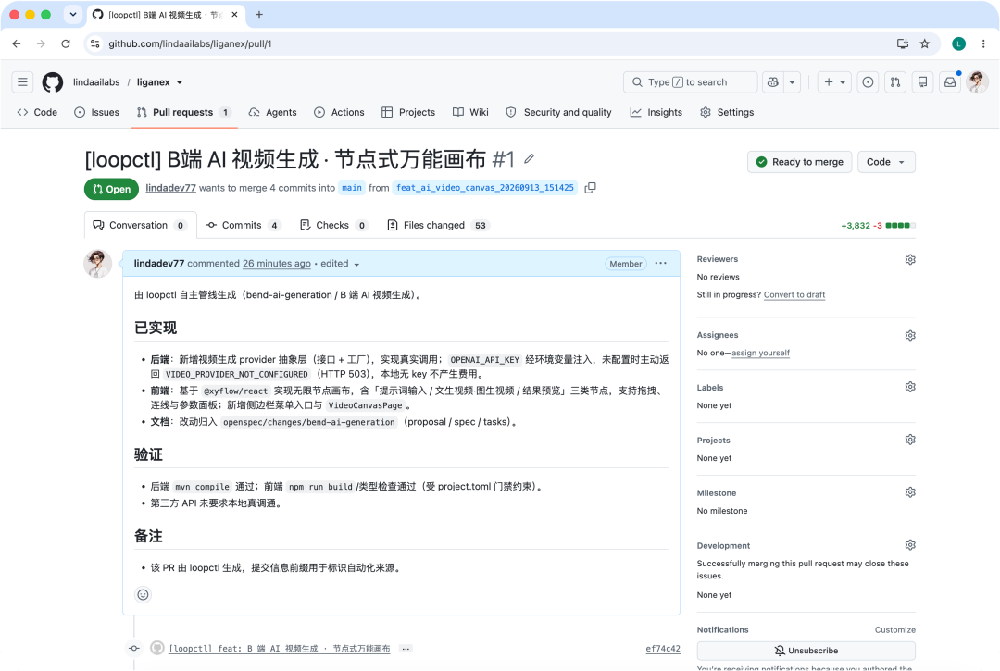

# loopctl

> LangGraph-based control plane for coding agents.

`loopctl` orchestrates coding engines (such as Claude Code) as pluggable
execution units, driving a largely unattended **requirement → GitLab MR** loop
across multiple projects. Human involvement is consolidated into two gates:
plan approval and PR review.

This repository is the **tool** (open source). Project-specific knowledge
(specs, decisions, task reports) lives in a separate, private *playbook*
repository.

## Status

Active development — MVP (v0.1). See `docs/SPEC.md` for the authoritative
specification and `docs/decisions/` for the architecture decision records.

## Quick start

```bash
# Install (uv manages the environment)
uv sync

# Point to the private knowledge repository; optional for a sibling checkout
export LOOPCTL_PLAYBOOK_ROOT=/path/to/playbook

# Show the task board (empty before any task exists)
uv run loopctl status

# List registered projects
uv run loopctl projects

# Register and validate a real project
uv run loopctl init my-project --repo-path /path/to/repo \
  --test-cmd "pytest -q" --gitlab-project-id 12345
uv run loopctl doctor --project my-project

# Or register a GitHub-hosted project (PR instead of MR)
uv run loopctl init my-project --repo-path /path/to/repo \
  --provider github --github-repo owner/repo --test-cmd "pytest -q"
# Set GITHUB_TOKEN before a real GitHub run (same dry-run/offline rules apply).

# List the available execution engines
uv run loopctl engines
```

### End-to-end GitHub PR demo

loopctl can drive a GitHub-hosted project end to end and open a real pull
request. The screenshot below shows a PR that loopctl's autonomous pipeline
generated and pushed for the `liganex` project:



For a first, fully offline verification, initialize with `--engine fake`. The
fake engine and dry-run MR client exercise both approval gates without touching
a source repository or the network. Real runs require a clean git worktree and
create `<english_requirement>_<yyyyMMdd_HHmmss>` from the configured
`default_branch`. Use `--branch-name <english_label>` for non-English requirements.

Machine-specific configuration (repository paths, tokens, GitLab IDs) is injected
through configuration files and environment variables and is **never** committed.
Set `GITLAB_TOKEN` before a real run.
See `docs/SPEC.md` §6 for the configuration model.

## Development

```bash
uv sync                  # install dependencies (including the dev group)
uvx ruff check .         # lint
uvx ruff format .        # format
uv run pytest            # run tests
```

## License

MIT — see `LICENSE`.
